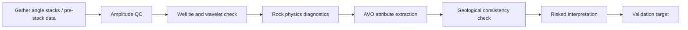

# AVO Interpretation Workflow

```mermaid
flowchart LR
    A["Gather angle stacks / pre-stack data"] --> B["Amplitude QC"]
    B --> C["Well tie and wavelet check"]
    C --> D["Rock physics diagnostics"]
    D --> E["AVO attribute extraction"]
    E --> F["Geological consistency check"]
    F --> G["Risked interpretation"]
    G --> H["Validation target"]
```

## Use

用于解释 AVO/AVA 分析不是单纯看异常，而是从数据质量、井震标定、岩石物理和地质一致性共同形成判断。

