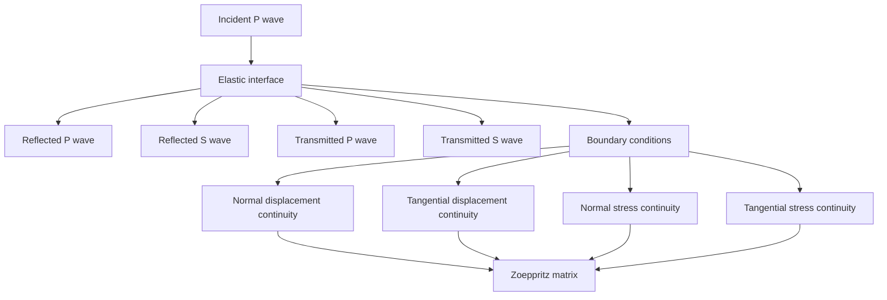

# Zoeppritz Boundary Conditions Diagram

```mermaid
flowchart TD
    A["Incident P wave"] --> B["Elastic interface"]
    B --> C["Reflected P wave"]
    B --> D["Reflected S wave"]
    B --> E["Transmitted P wave"]
    B --> F["Transmitted S wave"]

    B --> G["Boundary conditions"]
    G --> H["Normal displacement continuity"]
    G --> I["Tangential displacement continuity"]
    G --> J["Normal stress continuity"]
    G --> K["Tangential stress continuity"]

    H --> L["Zoeppritz matrix"]
    I --> L
    J --> L
    K --> L
```

## Use

把这张图嵌入到 [[01_Geophysics_Core/Zoeppritz Equation Derivation]] 或 AVO 相关笔记中，用来解释方程组来自四个边界条件。

